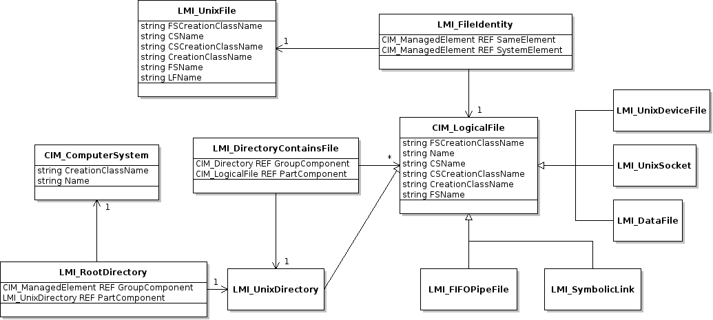

.. _script_tutorial:

Script Tutorial
===============

This is a step-by-step tutorial on developing script library for
*OpenLMI* providers.

Required knowledge
------------------

You should be familiar with terms like *CIM*, *cimom*, *schema*,
*provider*, *DMTF* profile.
`This <http://fedorahosted.org/openlmi/wiki/ProviderTutorialIntroduction>`_
short tutorial should be enough to get you started.

You should also be familiar with scripting in *python* and
`lmishell <http://www.openlmi.org/using_lmishell>`_ which we use heavily
in snippets below.

Preparation
-----------

This tutorial assumes you have ``tog-pegasus`` *cimom* up and running
with ``openlmi-logicalfile`` providers installed and registered on
remote host. We will connect to it from client machine which needs the
following installed:

* ``openlmi-python-base``
* ``openlmi-tools``
* ``openlmi-scripts``

Installing python dependencies
~~~~~~~~~~~~~~~~~~~~~~~~~~~~~~

For the first two items you may use standard rpms build for Fedora. The
first one is available from ''OpenLMI Nightly'' repository having the
newest builds:

.. code-block:: sh

    cat > /etc/yum.repos.d/openlmi-nightly.repo
    [openlmi-nightly]
    name=openlmi-nightly
    baseurl=http://openlmi-rnovacek.rhcloud.com/rpm/rawhide/
    gpgcheck=0
    enabled = 1
    ^D

And then run:

.. code-block:: sh

    yum install openlmi-python-base openlmi-tools

Or you may install them to your user directory as python eggs with
``pip``:

.. code-block:: sh

    pip install openlmi-python openlmi-tools

The last one can only be installed with ``pip``:

.. code-block:: sh

    pip install openlmi-scripts

Or directly from git repository (viz `below <#install_from_git>`_).

Setting up environment
~~~~~~~~~~~~~~~~~~~~~~

We'll stick to the process described
`here <https://github.com/openlmi/openlmi-scripts#developing-lmi-scripts>`_
that let us develop quickly without the need to reinstall anything while
making changes.

First let's check out our ``openlmi-scripts`` repository:

::

    git clone https://github.com/openlmi/openlmi-scripts.git
    cd openlmi-scripts

Optionally we may install ``openlmi-scripts`` to user directory if not
having done yet:

.. code-block:: sh

    python setup.py install --user

Then let's set up the workspace directory:

.. code-block:: sh

    WSP=~/.python_workspace
    mkdir $WSP
    # may be added to `$HOME/.profile` or `$HOME/.bashrc`
    export PYTHONPATH=$WSP:$PYTHONPATH
    export PATH="$PATH:$WSP"

Making our command structure
~~~~~~~~~~~~~~~~~~~~~~~~~~~~

We'll use provided ``commands/make_new.py`` script to create the basic
structure and ``setup.py`` file:

.. code-block:: sh

    cd commands
    # this will ask us additional questions used to create setup.py file
    ./make_new.py mylf

Because a script implementation for ``OpenLMI LogicalFile`` profile is
already present in upstream repository (in ``commands/logicalfile``), we
need to name our library distinctly (e.g. ``mylf``).

Following structure should be created:

::

    mylf
    ├── doc
    │   ├── _build
    │   ├── cmdline.rst
    │   ├── conf.py
    │   ├── err.log
    │   ├── index.rst
    │   ├── make.bat
    │   ├── _static
    │   └── _templates
    ├── lmi
    │   ├── __init__.py
    │   └── scripts
    │       ├── __init__.py
    │       └── mylf
    │           ├── cmd.py
    │           └── __init__.py
    ├── README.md
    └── setup.py

We should check that everything matches in ``mylf/setup.py`` and correct
any shortcomings.

OpenLMI LogicalFile introduction
--------------------------------

*OpenLMI LogicalFile* is a CIM provider which provides a way to read
information about files and directories. The provider also allows to
traverse the file hierarchy, create and remove empty directories.

   LogicalFile model

It consists mainly of few specializations of ``CIM_LogicalFile``
representing any type of file on filesystem, ``LMI_UnixFile`` holding
unix specific information for each such file and association classes
between them. ``CIM_LogicalFile`` has following key properties inherited
by ``LMI_*`` subclasses above:

*  **Name**
*  **CSName**
*  **CSCreationClassName**
*  ``FSCreationClassName``
*  ``CreationClassName``
*  ``FSName``

Only those shown in **bold** are mandatory. Others are ignored when
requesting an instance of ``CIM_LogicalFile``. This applies also to
``LMI_UnixFile`` with **Name** being replaced with **LFName**. None of
the presented classes supports enumeration of instances. Only references
can be obtained.

With ``CreateInstance()`` and ``DeleteInstance()`` calls issued on
class/object of ``LMI_UnixDirectory`` we are able to create and delete
directories.

Writing usage string
~~~~~~~~~~~~~~~~~~~~

Usage string is a module's documentation, help message and a
prescription for command line parser all-in-one. Writing it is pretty
straightforward. Let's put it to ``mylf/lmi/scripts/mylf/cmd.py``:

::

    """
    Read informations about file system structure.

    Usage:
        %(cmd)s list [options] <directory>
        %(cmd)s show [-L] <file>
        %(cmd)s create <directory>
        %(cmd)s delete <directory>

    Options:
        -t --type <type>    Filter listed files by their type. One of:
                            any, file, device, directory, fifo, symlink, socket.
                            Defaults to any.
        -L --dereference    Causes symlink to be followed.
    """

The first line provides a short description shown in help of ``lmi``
meta-command for its registered subcommand. Text under ``Usage:`` and
``Options:`` are parsed by ``doctopt``. Please refer to its
documentation at http://docopt.org for more information.

**Note** the ``%(cmd)s`` string which needs to be present instead of
``lmi mylf`` or similar command names.

Let's add one more snippet so we can test it:

::

    from lmi.scripts.common import command

    MyLF = command.register_subcommands('MyLF', __doc__, {})

This creates a command multiplexer without any children (we'll add them
later).

And finally let's modify our ``mylf/setup.py`` by adding entry point:

::

        entry_points={
            'lmi.scripts.cmd': [
                'mylf = lmi.scripts.mylf.cmd:MyLF',
                ],
            }

Now we can install it and test it:

.. code-block:: sh

    # make sure the $WSP is in $PYTHONPATH
    python mylf/stup.py develop --install-dir=$WSP
    lmi help
    lmi help mylf

We should be able to see the usage string we've written.

Implementing ``list``
~~~~~~~~~~~~~~~~~~~~~

Most of neccessary functionality has been implemented in previous
snippet for the ``show`` command. Following snippet is enough to
generate all the files in directory. Put it again to
``mylf/lmi/scripts/mylf/__init__.py``.

::

    def make_directory_instance_name(ns, directory):
        """
        Retrieve object path of a directory.

        :type directory: string
        :param directory: Full path to the directory.
        :rtype: :py:class:`lmi.shell.LMIInstanceName`
        """
        if directory != '/':
            directory = directory.rstrip('/')
        cs = get_computer_system(ns)
        return ns.LMI_UnixDirectory.new_instance_name(
                { 'CSCreationClassName' : cs.classname
                , 'CSName'              : cs.name
                , 'CreationClassName'   : 'LMI_UnixDirectory'
                , 'FSCreationClassName' : 'LMI_LocalFileSystem'
                , 'FSName'              : ''
                , 'Name'                : directory})

    def get_directory_instance(ns, directory):
        """
        Retrieve instance of `LMI_UnixDirectory`.

        :type directory: string of :py:class:`lmi.shell.LMIInstanceName`
        :param directory: Full path to the directory or its instance name.
        :rtype: :py:class:`lmi.shell.LMIInstance`
        """
        if isinstance(directory, basestring):
            directory = make_directory_instance_name(ns, directory)
        if isinstance(directory, LMIInstanceName):
            directory = directory.to_instance()
        return directory

    def list_directory(ns, directory, file_type='any'):
        """
        Yields instances of ``CIM_LogicalFile`` representing direct children of the
        given directory.

        :param directory: Either a file path or an instance of
            ``LMI_UnixDirectory``.
        :param file_type: Filter of files made by checking their type. One of: ::

            {'any', 'file', 'device', 'directory', 'fifo', 'symlink', 'socket'}
        """
        def _generate_children():
            for child in get_directory_instance(ns, directory).associators(
                    AssocClass='LMI_DirectoryContainsFile',
                    Role='GroupComponent',
                    ResultRole='PartComponent'):
                if (   file_type and file_type != 'any'
                   and logical_file_type_name(child) != file_type):
                    continue
                yield child
        return sorted(_generate_children(), key=lambda i: i.Name)

Note the ``associators()`` call on ``LMI_UnixDirectory`` instance. It
enumerates all ``CIM_LogicalFile`` instances that are referenced by
``LMI_DirectoryContainsFile`` associations. These represent a relation
of parent directory and its direct children. Parent directory is
referenced with ``GroupComponent`` role while the children with
``PartComponent``. It's advisable to always provide as much information
to calls like:

-  ``associators()``
-  ``associator_names()``
-  ``references()``
-  ``reference_names()``

as possible. Without the ``AssocClass`` parameter given, broker would
try to enumerate all instrumented association classes possible,
resulting in very poor performance. Both ``Role`` and ``ResultRole``
parameters need to be given here, otherwise a parent directory of the
one being enumerated would also appear in output.

Following subclass of ``LmiInstanceLister`` needs to be added to
``mylf/lmi/scripts/mylf/cmd.py`` and added to ``MyLF`` subcommands
dictionary (omitted for now).

::

    class List(command.LmiInstanceLister):
        CALLABLE = mylf.list_directory
        PROPERTIES = (
                'Name',
                ('Type', mylf.logical_file_type_name),
                ('Permissions', mylf.permission_string),
                ('Size', 'FileSize'))

        def verify_options(self, options):
            if (   options['--type'] is not None
               and not options['--type'].lower() in {
                   'any', 'file', 'directory', 'symlink', 'dev', 'socket', 'fifo'}):
                raise errors.LmiInvalidOptions(
                        'Unsupported type: %s' % options['--type'])

        def transform_options(self, options):
            file_type = options.pop('--type')
            if file_type is None:
                file_type = 'any'
            options['file-type'] = file_type

Instead of defining our own ``execute()`` method, we just associate
wrapped function defined previously using ``CALLABLE`` property. Thanks
to the ability to transform option names in any way, we are not limited
to the use of arguments as listed in usage string. Apart from renaming
options, we also check for the value of ``--type``. Overriding
``verify_options()`` to check for validity of options is the more
preferred approach compared to delayed checking in associated function.

Implementing ``create`` and ``delete``
~~~~~~~~~~~~~~~~~~~~~~~~~~~~~~~~~~~~~~

Let's again start with content of ``mylf/lmi/scripts/mylf/__init__.py``
module.

::

    def create_directory(ns, directory):
        """
        Create a directory.

        :type directory: string
        :param directory: Full path to the directory.
        """
        ns.LMI_UnixDirectory.create_instance(
                make_directory_instance_name(ns, directory).path.keybindings)

    def delete_directory(ns, directory):
        """
        Delete an empty directory.

        :param directory: Either a file path or an instance of
            ``LMI_UnixDirectory``.
        """
        get_directory_instance(ns, directory).delete()

``create_instance()`` call of any ``LMIClass`` creates a new instance,
in this case we create an instance of ``LMI_UnixDirectory``. If it
exists already, an exception will be raised. On the other hand,
``delete_directory()`` operates on an ``LMIInstance`` which must exists.
If directory does not exist or it's not empty, an exception will be
raised.

Now let's move on to ``mylf/lmi/scripts/mylf/cmd.py``:

::

    class Create(command.LmiCheckResult):
        EXPECT = None
        CALLABLE = mylf.create_directory

    class Delete(command.LmiCheckResult):
        EXPECT = None
        CALLABLE = mylf.delete_directory

``LmiCheckResult`` is a special command that prints no useful
information. It allows us to check, whether the associated function
returns expected result and prints an error if not. Here we expect
``None``. Associated functions in this case throw an exception upon any
error which have the same effect. For more information please refer to
its
`documentation <http://pythonhosted.org/openlmi-scripts/command-classes.html#lmicheckresult>`_.

Test it
~~~~~~~

::

    lmi -h $HOST mylf create /root/some_directory
    # try it for the second time (it will fail)
    lmi -h $HOST mylf create /root/some_directory
    # now let's delete it
    lmi -h $HOST mylf delete /root/some_directory
    # try it for the second time (it will fail)
    lmi -h $HOST mylf delete /root/some_directory

Summary
-------

Now that the script is ready and tested, we may commit it, push it, do a
pull request (on
`github <https://help.github.com/articles/using-pull-requests>`_) and
host it on `PyPI <https://pypi.python.org/pypi>`_:

::

    python setup.py register
    python setup.py sdist upload

You can also download source tarball :download:`tarball <_static/mylf.tar.gz>`.

