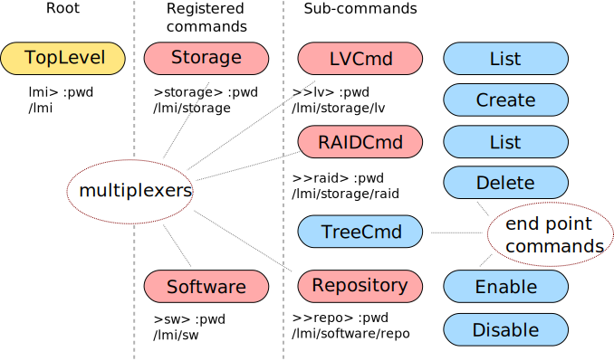

`lmi` meta-command usage
========================
``lmi`` meta-command is a command line utility build on top of client-side
libraries. Each library for particular set of providers can declare one or
more commands that will be registered with ``lmi`` meta-command and will be
available to user at command line.

Running from command line
-------------------------
It can run single command given on command line like this: ::

    lmi -h ${hostname} service list --all

Getting help
------------
For detailed help run: ::

    lmi --help

To get a list of available commands with short descriptions: ::

    lmi help

For help on a particular registered command: ::

    lmi help service

Running in interactive mode
---------------------------
Or it can be run in interactive mode when command is omitted: ::

    lmi -h ${hostname}
    lmi> help
    ...
    lmi> sw search django
    ...
    lmi> sw install python-django
    ...
    lmi> exit

The most important command is ``help`` which shows you possible commands.
It also accepts arguments: ::

    lmi> help storage raid

prints help for raid subcommand of storage command. The same behaviour is achieved
with: ::

    lmi> storage raid --help

Built-in commands
~~~~~~~~~~~~~~~~~
Interactive mode comes with few special commands. To get their list together
with help, type: ::

    lmi> : help

They are prefixed with ``:`` and optional space. Currently only namespace nesting
commands are supported. Those are ``:cd``, ``:..`` and ``:pwd``.

Command namespaces
~~~~~~~~~~~~~~~~~~
Most end-point commands (also known as multiplexers) have one or more subcommands
assigned. Namespace of such multiplexer is comprised of these subcommand's names.
The root multiplexer (also known as top-level command) has namespace comprised of
registered commands.

Above figure depicts command tree. On the left side is a top-level command. It
has two registered commands (``Storage`` and ``Software``) that creates its
namespace. Each of them has their own sub-commands -- either another
multiplexer (``LVCmd``, ``Repository``, etc.) or an end-point command.

Under each multiplexer or top-level command is corresponding prompt with path.
This prompt becomes active when ``:cd`` command is used to nest into particular
command's namespace. Such a namespace begins an active one. Just one namespace
can be active at a moment. Commands from non-active namespaces are not
available. For example if ``RAIDCmd`` is currently active -- current command
path is ``/lmi/storage/raid``, just ``list`` and ``delete`` commands are
available ( note that in reality ``RAIDCMD`` has a lot more subcommands). Thus
one can not write ``enable`` or ``disable`` which belongs to ``Repository``
command's namespace.

There is also something like global namespace containing static commands and
built-ins. Commands from global namespace are accessible from any active
namespace.

Static commands
+++++++++++++++

    +------+------------------------------------------------------------------+
    | EOF  | Same as hitting ``^D``. If some nested into some subcommand's    |
    |      | namespace, it will map to ``:cd ..`` and parent namespace will   |
    |      | become active. If the top-level namespace is active, program     |
    |      | will exit.                                                       |
    +------+------------------------------------------------------------------+
    | exit | Exits immediately. It accepts optional exit code as an argument. |
    +------+------------------------------------------------------------------+
    | help | Lists available commands. Accepts command path as an optional    |
    |      | argument.                                                        |
    +------+------------------------------------------------------------------+

Changing command namespaces
---------------------------
Changing or nesting to some command namespace can be achieved with built-in
commands ``:cd`` and ``:..``. The latter is just a shortcut for ``:cd ..`` that
changes to parent namespace. ``:cd`` accepts a path to command. Whole command
path begins with ``/lmi`` prefix which denotes top-level command. Path
beginning with a ``'/'`` is an absolute path, which means it contains all
command names on a path from top-level command to target one. Other paths are
relative to current command.

Here is a an example of changing command namespaces: ::

    lmi> :pwd
    /lmi
    lmi> :cd storage
    >storage> :pwd
    /lmi/storage
    >storage> :cd lv
    >>lv> :pwd
    /lmi/storage/lv
    >>lv> :cd ../raid
    >>raid> :cd ../../sw/repo
    >>repo> :..
    >sw> :cd /storage       # /lmi prefix is optional for absolute paths
    >storage :cd /
    lmi>

